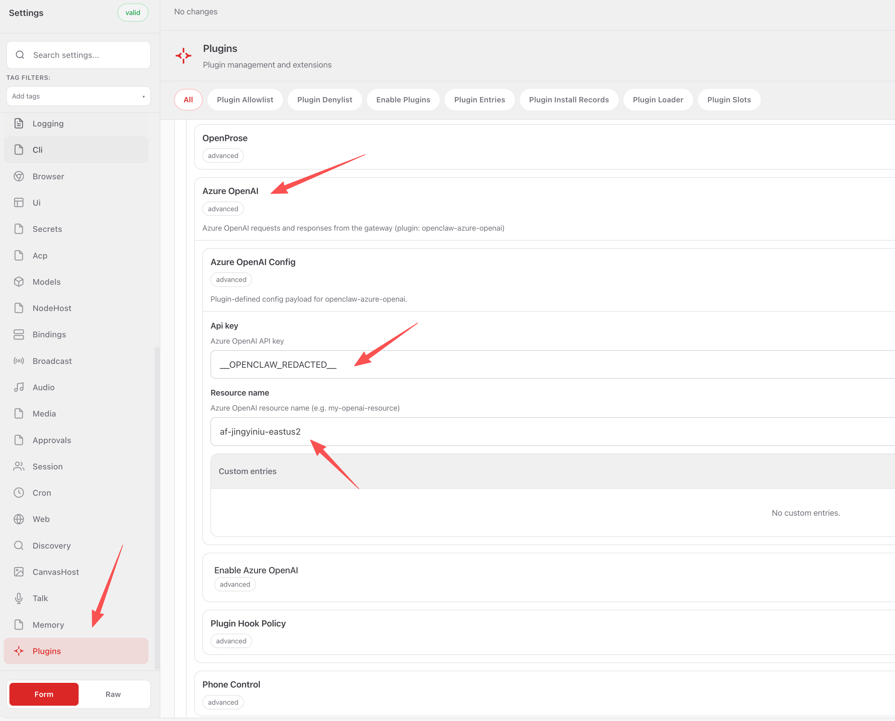

# openclaw-azure-openai

[English](#english) | [中文](#中文)

---

## English

An OpenClaw plugin that integrates Azure OpenAI as a model provider. It automatically registers Azure OpenAI models into your OpenClaw configuration so you can use them directly through the OpenClaw gateway.

### Supported Models

| Model ID       | Name         |
| -------------- | ------------ |
| `gpt-5.3-chat` | GPT 5.3 Chat |
| `gpt-5.4`      | GPT 5.4      |
| `gpt-5.4-pro`  | GPT 5.4 Pro  |

### Prerequisites

- [OpenClaw](https://openclaw.ai) installed and configured
- An Azure OpenAI resource with a valid API key

### Installation

```bash
openclaw plugins install openclaw-azure-openai
```

### Configuration

After installation, configure the plugin with your Azure OpenAI credentials. Navigate to **Settings > Plugins > Azure OpenAI** in the OpenClaw UI:



| Parameter       | Required | Description                                                 |
| --------------- | -------- | ----------------------------------------------------------- |
| `resource_name` | Yes      | Your Azure OpenAI resource name (e.g. `my-openai-resource`) |
| `api_key`       | Yes      | Your Azure OpenAI API key                                   |

#### Example configuration

Alternatively, you can edit `openclaw.json` directly:

```json
{
  "plugins": {
    "openclaw-azure-openai": {
      "resource_name": "my-openai-resource",
      "api_key": "your-api-key-here"
    }
  }
}
```

### Troubleshooting

- **"resource name or API key is not set"** -- Make sure both `resource_name` and `api_key` are provided in the plugin config.
- **"Failed to read openclaw.json"** -- Verify that the `openclaw.json` file exists at the expected path (`~/.openclaw/openclaw.json`).

---

## 中文

一个 OpenClaw 插件，用于将 Azure OpenAI 集成为模型提供者。它会自动将 Azure OpenAI 模型注册到你的 OpenClaw 配置中，让你可以直接通过 OpenClaw 网关使用这些模型。

### 支持的模型

| 模型 ID        | 名称         |
| -------------- | ------------ |
| `gpt-5.3-chat` | GPT 5.3 Chat |
| `gpt-5.4`      | GPT 5.4      |
| `gpt-5.4-pro`  | GPT 5.4 Pro  |

### 前置条件

- 已安装并配置 [OpenClaw](https://openclaw.ai)
- 拥有一个 Azure OpenAI 资源及有效的 API Key

### 安装

```bash
openclaw plugins install openclaw-azure-openai
```

### 配置

安装完成后，在 OpenClaw 管理界面中进入 **Settings > Plugins > Azure OpenAI** 配置插件：


| 参数            | 是否必填 | 说明                                               |
| --------------- | -------- | -------------------------------------------------- |
| `resource_name` | 是       | Azure OpenAI 资源名称（例如 `my-openai-resource`） |
| `api_key`       | 是       | Azure OpenAI API 密钥                              |

#### 配置示例

也可以直接编辑 `openclaw.json`：

```json
{
  "plugins": {
    "openclaw-azure-openai": {
      "resource_name": "my-openai-resource",
      "api_key": "your-api-key-here"
    }
  }
}
```

### 常见问题

- **"resource name or API key is not set"** -- 请确认 `resource_name` 和 `api_key` 均已在插件配置中填写。
- **"Failed to read openclaw.json"** -- 请检查 `openclaw.json` 文件是否存在于预期路径（`~/.openclaw/openclaw.json`）。
